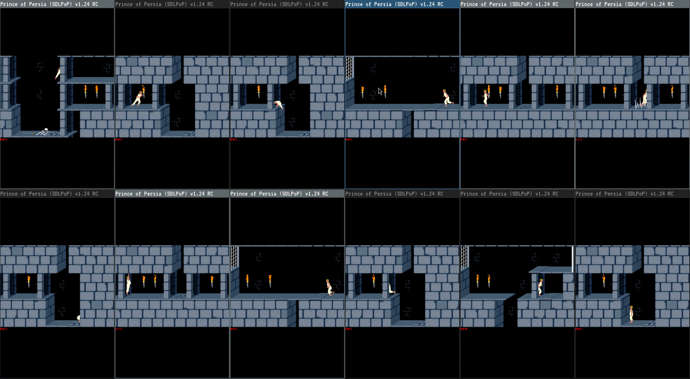

# Principia
## Experiments in Prince of Persia, 1989 using Reinforcment Learning.

Currently able to get the sword!

### Dependencies
sudo pacman -S base-devel sdl2 sdl2_image python python-pip pkg-config

pip install gymnasium numpy pillow stable_baselines3 stable_baselines3[extra] torch tensorboard

    [the steps below are not needed anymore, on arch atleast, don't know about other distros]

cd SDLPoP/src

make clean

make shared

cd ../..

### helpful commands

nm -D ./SDLPoP/src/libSDLPoP.so [very useful command to find what methods are available in libSDLPop.so file, just pipe em up!]

Yes, the readme is terrible, will update soon....
